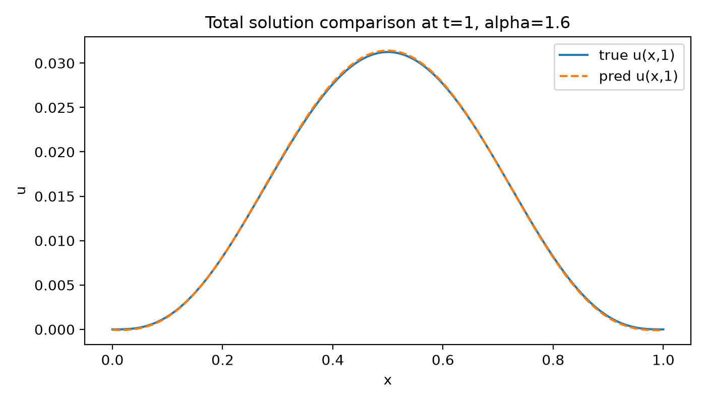
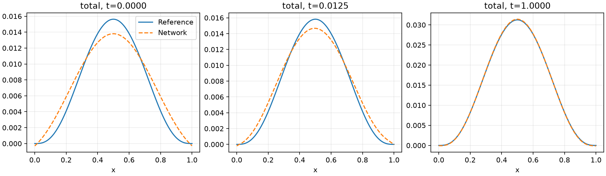
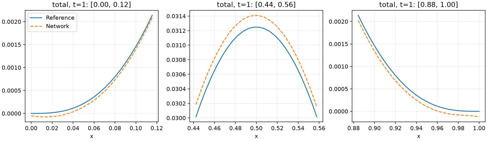

# Example 2 · 一维对流扩散

PINN 使用频域方程与初值数据输出 u1；FNO 以源项和时空坐标为输入，输出响应 g 并累积得到 u2；最终输出 u=u1+u2。本目录集中展示代码、解的对比和误差；训练记录及模型等复现材料放在 other。

## 文件入口

- [`main.py`](main.py)：单个 α 的运行入口。
- [`images/`](images/)：按 α 分开的解对比、误差、初值/边缘和局部放大图。
- [`results_summary.csv`](results_summary.csv)：本例五种 α 的最终误差汇总。
- [`other/`](other/)：按 α 保存模型、原始数组、指标和训练记录；训练图归入各 α 的 `training_image/`。
- [`other/support/`](other/support/)：代码依赖的辅助模块，复现时与 `main.py` 一同保留。

## 架构与固定配置

空间观察区间 `[0,1]`，200 个空间点；T=1，M=80，dt=0.0125；预测频率截断 Kmax=8、逆变换节点 80。c=1，随机种子 0，网络采用 float32。 对流速度 ν=1。

| 设置 | PINN 分支 | FNO 分支 |
|---|---|---|
| 输入 | (k,t) | (f,x,t) |
| 输出 | 频域解的实部、虚部 | 源项响应 g，累积得到 u2 |
| 网络宽度 | 64 | 64 |
| 隐层/谱层 | 5 个全连接隐层，GELU | 4 个谱卷积层＋逐点卷积，GELU |
| 保留 Fourier 模态 | — | 16 |
| 输出头 | 64→2 | 64→128→1 |
| 优化器 | AdamW | Adam |
| 初始学习率 | 3e-4，余弦下降至 1e-5 | 1e-3 |
| 训练轮数 | 3000 | 3000 |
| 训练采样/网格 | 每轮方程点 512、初值点 512 | 80×200 |
| 损失权重 | 频域方程 10，初值 100，物理域项 0 | u2=1，g=0.1，IC=0.1，BC=0.1 |

FNO 使用独立参考 u2 标签，标签不由 PINN 预测值反推。 表格统计同一给定源项的网格重构结果。 网络架构和训练预算在五种 α 之间保持一致，未按结果另行调参。

α=0.4、0.8 的参考积分采用等价表达以控制积分网格规模；α>1 使用直接参考积分。六组完整网格的加密检查最大差为 2.83e-12。详见 [参数兼容性记录](other/smallalpha_compatibility.md)。

## 运行方法

进入 `example2` 目录后执行以下命令。已验证环境为 Python 3.11、PyTorch 2.5.1+cu121、RTX 3060 Laptop 6 GB。CPU 运行耗时更长。

```bash
python -m pip install -r ../requirements.txt

# 加载这一 alpha 已保存的权重，重新评估和出图
python main.py --stage evaluate --alpha 1.6

# 单独重新训练一个 alpha；另存复现目录，保留本次已保存的结果
python main.py --stage train --alpha 1.6 --out other/rerun_alpha_1_6
```

可将 `--alpha` 改为 `0.4`、`0.8`、`1.2`、`1.6` 或 `2.0`。本脚本未实现 α=1 的极限公式。代码一次只运行一种 α；不同 α 需要各自的训练权重。以上 α=1.6 命令的默认结果数据放在 `other/alpha_1_6/`，结果图整理到 `images/alpha_1_6/`；指定 `--out` 时，结果图放在指定目录的 `images/` 中。

## 最终误差

全时空指标覆盖 t=0 至 t=1 的 81 个输出时刻，每个时刻为 200 个空间点。`t1` 仅统计 t=1；相对 L2 为误差的 L2 范数与参考解 L2 范数之比。

| α | u1 MAE | u2 MAE | 总解 MAE | 总解相对 L2 | 总解最大绝对误差 | t=1 总解 MAE |
|---:|---:|---:|---:|---:|---:|---:|
| 0.4 | 4.043945e-04 | 2.659658e-05 | 4.068056e-04 | 4.114594e-02 | 1.918953e-03 | 5.936663e-05 |
| 0.8 | 1.963806e-04 | 1.143669e-04 | 2.823200e-04 | 3.013495e-02 | 1.918190e-03 | 1.628188e-04 |
| 1.2 | 8.958959e-05 | 5.675016e-06 | 9.183636e-05 | 1.865759e-02 | 1.921853e-03 | 8.703863e-06 |
| 1.6 | 5.004027e-05 | 7.463967e-05 | 1.093217e-04 | 1.467492e-02 | 1.923373e-03 | 9.028076e-05 |
| 2.0 | 3.823068e-05 | 9.056178e-05 | 1.119016e-04 | 1.377748e-02 | 1.980125e-03 | 1.027685e-04 |

完整 [`results_summary.csv`](results_summary.csv) 每个 α 一行，包含 u1、u2、total 三支的 MAE、RMSE、最大绝对误差、相对 L2，以及三支对应的 t=1 指标。列名中的 `t1_` 标记末时刻，未带该标记的列为全时空指标。`status=completed` 表示有可核对的实际 `metrics.json`；本表五种 α 均已完成运行。

## 图件和结果观察

下方选取 α=1.6 展示；五种 α 的完整结果按子目录保存在 [`images/`](images/)。







分支结果：[u1 与参考解对比](images/alpha_1_6/u1_compare_t1.png)；[u2 与参考解对比](images/alpha_1_6/u2_compare_t1.png)。

α=1.6 的总解全时空 MAE 为 `1.093217e-04`，t=1 的 MAE 为 `9.028076e-05`；最大点误差为 `1.923373e-03`，它不等同于平均误差。 初始时刻总解 MAE 为 `1.162157e-03`；u2 初值为零，初值误差集中在 u1 的重构。 按分支 MAE 比较，FNO/u2 较大；总解误差由两支误差相加得到，可能出现局部抵消。

本组固定配置的总解 MAE 在 α=1.2 时最小、α=0.4 时最大。这是各 α 的一次实际运行结果，不能据此假定误差随 α 单调变化。

数值方法及论文叙述见仓库 [`paper/`](../paper/) 中的配套 PDF。
