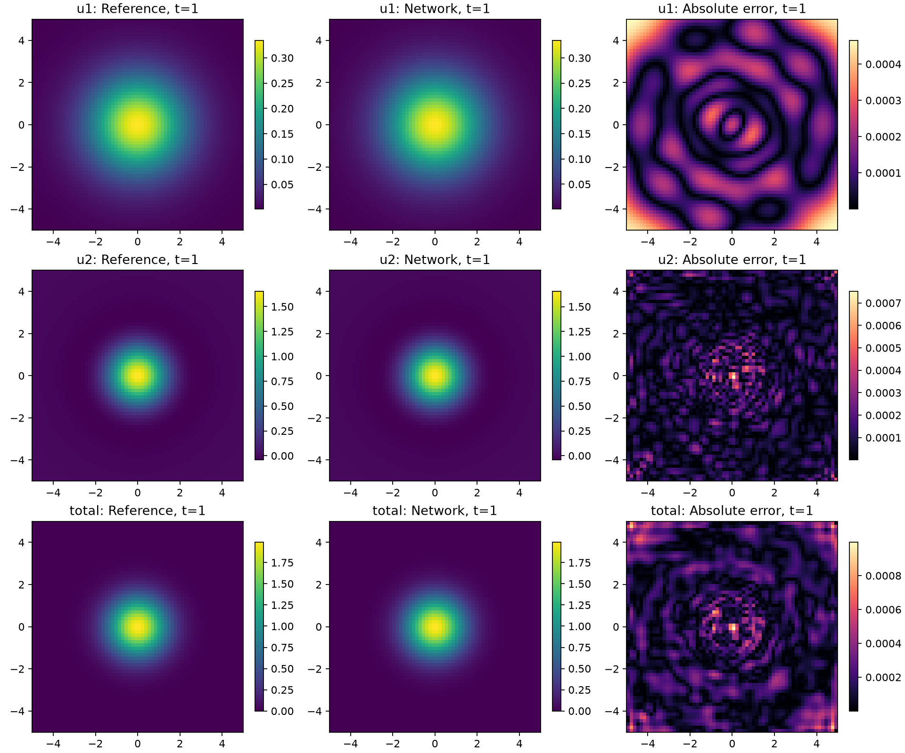
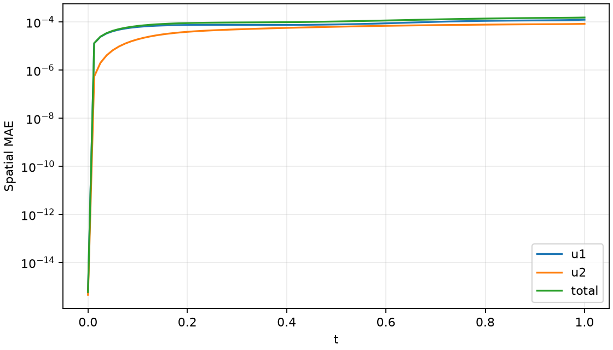

# Example 4 · 普通二维 Fourier PINN–FNO

本例使用独立的二维频率坐标和普通二维 FNO，不对神经网络施加径向对称性，也不做旋转、反射或转置平均。

算例为全空间 R² 上的分数阶扩散方程，c=1，t∈[0,1]，初值 exp(-(x²+y²)/2)，给定源项对应参考总解 u=(1+t)exp(-(x²+y²)/2)。图示和误差统计使用 [-5,5]² 观察窗口；窗口边缘不是零 Dirichlet 边界。

## 架构与设置

| 项目 | PINN：齐次分支 u1 | FNO：源项分支 u2 |
|---|---|---|
| 输入 | kx、ky、t，三个独立输入 | f(x,y,t)、归一化 x、归一化 y、实际时间 t |
| 网络 | 4 个隐藏层，每层 64，Tanh，两个输出通道 | 3 个二维谱层；width=24；每向保留 12 个模式；GELU |
| 输出 | 复幅值修正 aθ、bθ；由已知初谱组装 û1 | g=∂tu2，再按时间积分得到 u2 |
| 结构细节 | û1=û0[1+t·aθ+i·t·bθ]，严格满足初值 | 4→24 提升；谱卷积+1×1 卷积；8 格 padding；24→64→1 输出头 |
| 已知条件 | 初始 Fourier 数据，复值频域方程残差 | 零初值，g(0)=f(0)，输出参数化为 f+t·g_scale·Nθ |
| 训练数据 | 4096 点；每 250 次 Adam 重新采样；L-BFGS 使用 8192 点 | 80 个时间切片×64×64；另有 20 个不重合的数值验证切片 |
| 采样与缩放 | 1/4 均匀采样+3/4 已知初谱功率采样，重要性权重校正；float64 | f、g 的训练数据 RMS 缩放；float32；不做对称数据增强 |
| 优化器 | Adam 2500 次，学习率 1e-3→1e-5；L-BFGS 最多 500 次 | Adam 2500 次，batch=6；L-BFGS 120 次，另加 1200 次；全数据分块累计梯度 |
| 模型选择 | 固定预算结束后的参数；不看参考误差选模型 | 仅用独立数值验证切片的归一化 MSE 选模型 |

上述初值参数化和 g(0)=f(0) 来自本类常系数线性扩散方程，不使用 Gaussian 的径向对称性。频域方程符号本身的 (kx²+ky²)^(α/2) 是方程定义，网络仍接收独立的 kx、ky，允许同一半径不同方向产生不同输出。PINN 有 12866 个实参数，FNO 的复谱权重与两侧频率块在 `other/support/fno_model.py` 中明确保留。变系数或非线性方程需要相应调整分支方程与参数化。

共同参数：Kmax=8，空间网格 64×64，评估时间点 81 个（Δt=1/80），随机种子 20260916。数值数据使用每轴 128 点的完整 Cartesian 张量积积分，逐轴在零点分段并加密；RK4 最大时间步为 1/1280。PINN 预测逆积分每轴 96 点，参考逆积分每轴 192 点。全程计算完整二维频率场，没有使用径向积分或 Hankel/Bessel 降维。

## 训练数据与参考比较

训练、标签生成、参考评估分别由独立函数完成：

1. PINN 只读取已知初谱和 PDE；正时间的齐次解析演化不进入损失。
2. FNO 标签由给定源项驱动的零初值频域方程用 RK4 独立求解，再做完整二维逆积分。数据文件同时保存数值 u2 和 g，实际监督量是 g。标签不依赖 PINN，也不用 u−u1 的参考差值。
3. 训练结束后，才构造 u 的参考值、û1=û0 exp(-c|k|^αt) 的逆积分参考值，以及 u2_ref=u_ref−u1_ref。比较 u1、u2 和 u1+u2。

这五次训练评估的是本题固定源项随时间变化的重构能力。程序接口支持平移和不同 x/y 宽度的初值，数值模块另做了非径向、复值输入检查；这些检查不是对未见源项的 FNO 泛化实验。更换初值或源项后应重新生成数据和训练。

## 五个 α 的实际结果

以下均为本目录模型的实际运行结果。MAE 按全部 81×64×64 个点等权统计，relative L2=||预测−参考||₂/||参考||₂。完整 u1/u2/total 的 MAE、RMSE、最大绝对误差和 relative L2，以及 t=1 的相同指标，见 [results_summary.csv](results_summary.csv)。

| α | u1 全时空 MAE | u2 全时空 MAE | 总解全时空 MAE | 总解 relative L2 | 总解 t=1 MAE |
|---|---|---|---|---|---|
| 0.4 | 7.7061e-05 | 2.9713e-05 | 8.3273e-05 | 4.2991e-04 | 1.2194e-04 |
| 0.8 | 6.8139e-05 | 3.2279e-05 | 7.4838e-05 | 3.7370e-04 | 9.6357e-05 |
| 1.2 | 8.4937e-05 | 3.7943e-05 | 9.5916e-05 | 4.7268e-04 | 1.1935e-04 |
| 1.6 | 8.5726e-05 | 5.7267e-05 | 1.0734e-04 | 5.3081e-04 | 1.5454e-04 |
| 2.0 | 8.0483e-05 | 8.4208e-05 | 1.2048e-04 | 6.0656e-04 | 1.6355e-04 |

总解 relative L2 范围为 3.737e-04–6.066e-04。两支分别训练，总误差可能出现叠加或抵消，因此应同时看 u1、u2 的误差，不能只凭总解误差判断分支质量。数值标签与评估参考的最大差异不超过 3.660e-13，远小于本轮网络误差。

PINN 完整复逆积分的虚部也保存在预测文件中；论文物理解使用其实部，但这里另列完整复误差，避免隐去数值非 Hermitian 误差：

| α | 逆积分虚部最大值 | u1 完整复误差 relative L2 | PINN 逆积分 96→128 加密差 | 数值 u2 与参考最大差 |
|---|---|---|---|---|
| 0.4 | 3.412e-04 | 1.071e-03 | 5.680e-08 | 1.221e-14 |
| 0.8 | 4.371e-04 | 1.125e-03 | 1.870e-09 | 1.110e-14 |
| 1.2 | 4.366e-04 | 1.118e-03 | 2.151e-11 | 1.243e-14 |
| 1.6 | 3.470e-04 | 1.141e-03 | 3.945e-12 | 6.628e-14 |
| 2.0 | 3.180e-04 | 1.007e-03 | 3.753e-10 | 3.660e-13 |

加密差是本次抽查时间和网格上的一致性检查，不是严格的误差上界。更换源项、频率衰减或计算窗口后需要重新检查截断和求积精度。完整检查在 [other/cartesian_checks.json](other/cartesian_checks.json) 和各 α 的 `data_checks.json`、`pinn_checks.json`、`metrics.json`。

## 图片

每个阶数有独立的 `images/alpha_0_4`、`alpha_0_8`、`alpha_1_2`、`alpha_1_6`、`alpha_2_0`。其中：

- `branch_comparison.png`：t=1 的 u1、u2、总解参考/预测/绝对误差九宫格。
- `u1_validation.png`、`u2_validation.png`、`2d_result_t1.png`：单支二维对比。
- `*_initial_heatmap.png`、`*_initial_and_final.png`：初值、首个正时间及终值切片。
- `*_local_zoom.png`：中心及两侧小区间放大；切片位置按实际网格标注。
- `window_edge_values.png`：四条观察窗口边的中心附近点随时间对比。
- `error_time.png`、`u1_error_heatmap.png`、`u_error_heatmap.png`：时间误差和终值误差分布。
- `other/alpha_*/training_image/u1_losses.png`、`fno_losses.png`：实际训练记录对应的损失图；L-BFGS 横轴是目标函数评估次数。

以 α=1.6 为例：





α=1.6 的中心峰值曲线与参考基本重合，但远场小量仍有明显偏差：在观察窗口边附近，参考总解约为 1e-6 量级，而绝对误差可达 1e-4 量级。这里 u1 与 u2 的正负远场值需要相互抵消，分支误差会影响抵消后的微小总解。因此，全局相对 L2 较小不代表远场逐点相对误差也小；局部放大图和四边曲线保留了这一局限。

初值图验证两支在 t=0 的约束。初始 u2 理论参考为零，数值逆积分相减可能留下机器精度残差，因此初值约束应看绝对误差；该位置的相对误差会受接近零的分母影响。观察窗口边缘的参考值一般不等于零。训练图归在 other，主展示目录只保留结果图。

## 复现

建议使用 Python 3.11；本次环境为 PyTorch 2.5.1+cu121、NumPy 2.4.6、SciPy 1.17.1、Matplotlib 3.11.1，GPU 为 RTX 3060 Laptop 6 GB。训练和独立评估均关闭 matmul/cuDNN 的 TF32，保持精度设置一致。CUDA 不可用时自动用 CPU，耗时会变长。保留 `other/support` 辅助代码。依赖见根目录 [requirements.txt](../requirements.txt)。

进入本目录后，读取已有权重重算一个阶数的图和指标：

```bash
python main.py --stage evaluate --alpha 1.6
```

从头生成数据、训练并评估一个阶数，使用新输出目录保留本次结果：

```bash
python main.py --stage all --alpha 0.8 --out other/rerun_alpha_0_8
```

代码每次只跑一种 α，把参数改为 0.4、0.8、1.2、1.6、2.0 即可。也可分 `data`、`pinn`、`fno`、`evaluate` 四阶段执行，但须使用同一 α 和同一 `--out`；FNO 需要先生成数据，评估需要两个模型。`--out` 是相对于当前工作目录的路径。不指定 `--out` 时会写入本目录对应的正式 α 子目录。

求解预算参数为 `--pinn-epochs`、`--pinn-lbfgs`、`--fno-steps`、`--fno-lbfgs`、`--fno-refine`。改变预算得到的结果应另存。平移/不同宽度输入可用 `--shift-x`、`--shift-y`、`--sigma-x`、`--sigma-y` 配合新的 `--out`，例如平移 (0.6,-0.4)、宽度 (0.8,1.3)；当前五个正式结果均为原题输入。网络宽度、层数和模式数在两个模型模块中设置。

```text
example4/
  main.py                   单 α 运行入口
  readme.md                 架构、使用、实际误差
  results_summary.csv       本例五种 α 的最终误差
  images/alpha_*/            结果、误差、局部与初值图
  other/
    support/                PINN、FNO、二维数值计算及绘图代码
    cartesian_checks.json   求积/时间步/非径向数据检查
    alpha_*/                权重、数据、预测、日志及指标
      training_image/       实际训练损失图
```

核心训练过程使用已知初始条件、方程残差和独立数值数据；参考误差仅用于最终评估。
